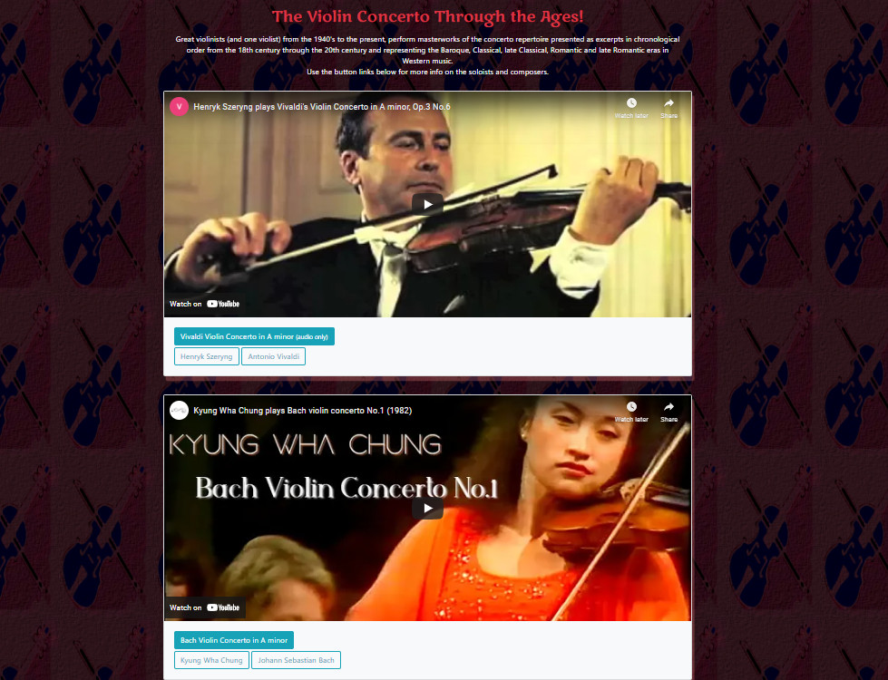
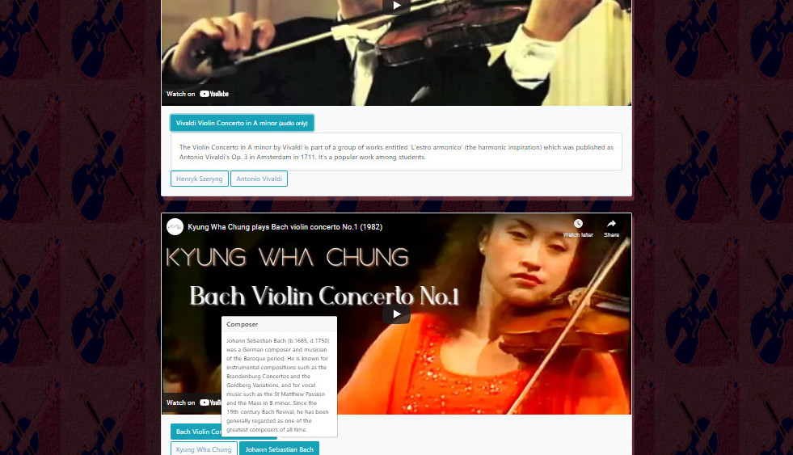

### (PHP app)
# Selections of violin concertos posted chronologically, played by some of the world's greatest violinists!
### Scroll down the app to view them!
 

### Click on the title button to get background on the work performed.
### Hover over the soloist or composer buttons to get bio info about them (See below).

 

### A brief history of Western classical music via violin, useful for students, or anyone looking for an introduction to this wonderful genre. 

#### Technologies used:
 - PHP
 - HTML
 - MYSQL/PDO
 - JavaScript
 - CSS/Bootstrap
 - GIMP Image Manipulaton Program

 ### Plan to add a form page in which vistors can submit comments/suggestions

